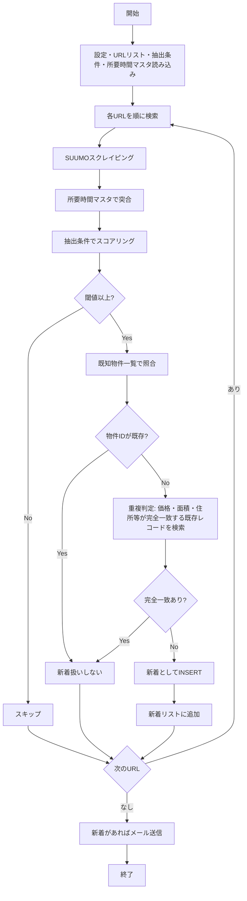

# SUUMO戸建・中古マンション 新着物件バッチ・メール配信システム 設計書

> この設計書に従って実装してください。AIエージェント向けに記述しています。

---

## 1. 概要

SUUMOの戸建・中古マンション検索を定期実行し、所定の条件に合致する物件のみを抽出し、新着物件を蓄積して指定メールアドレスに通知するバッチシステムを構築する。  
Web UIは不要。**GitHub Actions** でスケジュール実行し、自宅PCは不要とする。

---

## 2. スコープ

- **含める**: SUUMO新築・中古戸建・中古マンションの検索、所定条件による抽出、所要時間マスタの突合、新着検出、既知物件一覧への蓄積、メール配信
- **含めない**: 他サイト（HOME'S等）、物件詳細ページのスクレイピング（条件判定に必要な項目が一覧にない場合のみ検討）、Web UI

---

## 3. 用語・前提

- **物件ID**: SUUMOのURLに含まれる `nc_XXXXXXXX` 形式の一意識別子
- **検索条件**: URLリストCSVに記載されたSUUMO検索URL（種別・都道府県・URL）
- **所定の条件**: 別ファイル（`extraction_conditions.yaml`）で定義するスコアリング条件。各要素のスコアを合算し、閾値以上だった物件のみを抽出対象とする
- **新着**: 前回実行時点でDBに存在しなかった物件ID。ただし、**重複判定**（後述）に該当する場合は新着扱いしない
- **重複判定**: 事業者が別IDで同一物件を再アップロードするケースがあるため、価格・建物面積などが完全一致する既存レコードがあれば、新着としては扱わない
- **既存コード**: `app_realestate.py` のスクレイピングロジックを流用する

---

## 4. データモデル

### 4.1 物件レコードのスキーマ

`known_properties.json` に格納する各物件の形式。配列として保持。

| カラム名 | 型 | NULL | 説明 |
|---------|-----|------|------|
| property_id | VARCHAR(20) | NO | 物件ID（PK）。nc_XXXXXXXX |
| property_url | TEXT | YES | 物件詳細URL |
| property_name | VARCHAR(500) | YES | 物件名 |
| price_min | DECIMAL(10,2) | YES | 価格①（万円） |
| price_max | DECIMAL(10,2) | YES | 価格②（万円） |
| address | TEXT | YES | 住所 |
| nearest_station | VARCHAR(100) | YES | 最寄り駅 |
| walk_minutes | INT | YES | 徒歩分数 |
| land_area | DECIMAL(10,2) | YES | 土地面積（m²）。戸建用 |
| building_area | DECIMAL(10,2) | YES | 建物面積（m²） |
| layout | VARCHAR(50) | YES | 間取り |
| built_year | VARCHAR(50) | YES | 築年数 |
| category | VARCHAR(50) | YES | 種別（新築戸建/中古戸建/中古マンション等） |
| prefecture | VARCHAR(20) | YES | 都道府県 |
| time_to_workplace | INT | YES | 職場まで所要時間（分）。所要時間マスタで突合 |
| total_time | INT | YES | 合計時間（分）= 職場まで + 徒歩分数 |
| extraction_score | DECIMAL | YES | 所定の条件ポイント合算値。全物件一覧の並び順に使用 |
| first_seen_at | DATETIME | NO | 初回検出日時 |
| created_at | DATETIME | NO | レコード作成日時 |

**重複判定用**: `price_min`, `price_max`, `building_area`, `address`, `nearest_station` 等が完全一致する既存レコードがあれば、別IDでも同一物件とみなす。比較に使うカラムは実装時に決定（少なくとも 価格・建物面積・住所 は必須）。

### 4.2 永続化（GitHub Actions 対応）

GitHub Actions は実行ごとに環境がリセットされるため、**リポジトリ内のファイル**で永続化する。

- **known_properties.json**: 既知の物件一覧。`[{ "property_id", "price_min", "price_max", "building_area", "address", ... }, ...]` 形式。新着判定・重複判定に使用。実行後に更新し、コミット・プッシュする
- **ローカル実行時**: SQLite（`data/suumo.db`）も利用可能。設定で `storage: file`（JSON）または `storage: sqlite` を切り替え

### 4.3 その他

- **URLリスト**: CSVファイルで管理。列: `種別`, `都道府県`, `URL`。リポジトリに含める
- **所要時間マスタ**: `station_time.xlsx`（プロジェクトフォルダ内）。後述の形式。最寄り駅で突合し `time_to_workplace` を設定
- **抽出条件定義**: `extraction_conditions.yaml`（別ファイル。後述）

---

## 5. 処理フロー

### 5.1 メインフロー（1回のバッチ実行）



### 5.2 処理の詳細

1. 設定ファイルから メール設定・URLリストパス・**抽出条件ファイルパス**・**所要時間マスタパス**を読み込む
2. **既知物件一覧**（`known_properties.json`）を読み込む。初回は空
3. URLリストの各行について、SUUMO検索を実行（全ページ取得。戸建・中古マンション両対応）
4. 各物件について、**所要時間マスタ**を最寄り駅で突合し、職場まで所要時間・合計時間を付与
5. **抽出条件**（`extraction_conditions.yaml`）に基づきスコアを計算。閾値未満の物件は以降の処理対象外
6. 閾値以上の物件について、`property_id` で既知一覧を照合
7. **物件IDが既存の場合**: 既に登録済み。スキップ
8. **物件IDが新規の場合**: 重複判定。価格・建物面積・住所等が完全一致する既存レコード（別のproperty_id）が存在するか検索
   - 完全一致あり: 事業者が別IDで再アップロードした同一物件とみなし、**新着扱いしない**
   - 完全一致なし: 真の新着。既知一覧に追加し、新着リストに追加
9. **全物件一覧ページ**を生成。**今回の検索で取得した物件のうち閾値以上のもののみ**を、条件ポイント合算値の降順で並べたHTML（例: `docs/properties_list.html`）を出力。※既知物件DB（known_properties）は累積のため、そこから一覧を出すとSUUMOで削除済みの物件が死にリンクとして残る。そのため一覧のデータソースは**当該実行のスクレイピング結果**とし、毎回「今検索にヒットした物件だけ」を表示する
10. 全URL処理後、新着があればメール送信。**メール本文**: 新着件数・新着一覧に加え、**全物件一覧ページへのリンク**
11. **既知物件一覧を更新**し、`known_properties.json` に保存。GitHub Actions の場合は一覧ページと合わせてコミット・プッシュ

---

## 6. 入出力・インターフェース

### 6.1 入力

- **URLリストCSV**: 列 `種別`, `都道府県`, `URL`。**並び順は 1列目＝種別・2列目＝都道府県・3列目＝URL とすること。** ヘッダーが文字化けして読めない環境でも、この順序で列を解釈する。UTF-8 または Shift_JIS。**配置**: `docs/` 内（例: `docs/suumo_url_list.csv`）。パスは設定で指定
- **抽出条件定義**: `extraction_conditions.yaml`（別ファイル。`docs/extraction_conditions.yaml` を参照）
- **所要時間マスタ**: `station_time.xlsx`（プロジェクトフォルダ内）。形式は 6.5 参照
- **設定**: `config.yaml` または環境変数
  - `storage`: `file`（GitHub Actions 用。known_properties.json）または `sqlite`（ローカル用。`data/suumo.db`）
  - `url_list_path`: URLリストCSVのパス（デフォルト: `./docs/suumo_url_list.csv`）
  - `extraction_conditions_path`: 抽出条件YAMLのパス（例: `./docs/extraction_conditions.yaml`）
  - `station_time_master_path`: 所要時間マスタのパス（デフォルト: `./station_time.xlsx`）
  - `known_properties_path`: 既知物件一覧のパス（デフォルト: `./data/known_properties.json`）
  - `smtp_host`, `smtp_port`, `smtp_user`, `smtp_pass`: SMTP設定（GitHub Secrets で渡す）
  - `from_email`, `to_emails`: メールアドレス（GitHub Secrets で渡す）
  - `delay_seconds`: 検索間隔（デフォルト: 1.0）

### 6.2 出力

- **既知物件一覧**: `known_properties.json` に新着を追加して更新
- **全物件一覧ページ**: **当該実行で取得した物件のうち閾値以上のもの**を、所定の条件ポイント合算値の降順で並べたHTMLを生成。リポジトリにコミットし、GitHub Pages 等で公開可能にする（死にリンクを防ぐため、既知物件DB全件ではなく「今回の検索結果」のみを表示する）
- **メール**: 新着物件の一覧に加え、**「全物件一覧（条件ポイント降順）」へのリンク**を含める
- **ログ**: 標準出力に出力。内容: 実行日時、検索URL数、取得件数、新着件数、エラー

### 6.3 コマンドライン

```
python run_batch.py [--config config.yaml] [--dry-run]
```

- `--config`: 設定ファイルのパス（省略時は `config.yaml` をカレントディレクトリから探す）
- `--dry-run`: DB書き込み・メール送信を行わず、検索と新着判定のみ実行
- 正常終了: 0、異常終了: 1

### 6.4 抽出条件定義ファイル（extraction_conditions.yaml）

別ファイル `docs/extraction_conditions.yaml` で定義する。スコアリング方式。

- **価格**: 都道府県別。東京・神奈川など。上限万円とスコアのマッピング
- **建物面積**: 下限m²とスコアのマッピング（100以上→1, 80以上→0, 70以上→-1 等）
- **駅徒歩**: 上限分とスコア（4分以下→2, 7分以下→1, 10分以下→0 等）
- **乗換回数**: 乗換なし→0.5, 1回→-0.5（所要時間マスタ・乗換案内から取得。一覧にない場合は要検討）
- **最寄～職場**: TTL45分以下→0, 60分以下→-1, 75分以下→-2（所要時間マスタで突合）
- **築年数**: 減点方式（要定義）
- **始発**: あり→1, なし→0（一覧で取得可能か要確認）
- **階数**: 2階建て→0.5, 3階建て→-0.5（戸建。一覧で取得可能か要確認）
- **閾値**: 合計スコアがこの値以上なら抽出対象

詳細は `docs/extraction_conditions.yaml` を参照。

### 6.5 全物件一覧ページ（条件ポイント降順）

- **目的**: メール受信者が、**直近の検索でヒットした物件**を条件ポイントの高い順で一覧できるようにする
- **データソース**: **今回のバッチ実行でスクレイピングし、閾値以上だった物件のみ**。既知物件DB（`known_properties.json`）は使わない。これにより、SUUMO上で削除された物件が一覧に残り死にリンクになることを防ぐ。DBの洗い替えは不要（新着判定・重複判定のためDBは累積のまま保持）
- **生成物**: HTML ファイル（例: `docs/properties_list.html`）。上記の物件を**所定の条件ポイント合算値の降順**で表示。各行に物件名・URL・価格・住所・ポイント等を記載
- **メールでの案内**: 配信メール内に「全物件一覧（条件ポイント降順）: https://...」のようなリンクを追加。GitHub Pages を有効にすれば `https://<user>.github.io/<repo>/docs/properties_list.html` でアクセス可能（または `raw` リンクでHTMLを直接開く運用も可）

### 6.6 所要時間マスタ（station_time.xlsx）

- **ファイル**: プロジェクトフォルダ内の `station_time.xlsx`
- **形式**: Excel（.xlsx）。1枚目のシートを使用
- **列構成**:
  - **駅名列**: 列名は `駅名` または `最寄り駅` のいずれか。最寄り駅名を格納
  - **所要時間列**: 列名は `職場まで所要時間(分)` または `所要時間` など「分」を含む列。数値（分）を格納
- **データの持ち方**: バッチ起動時に `pandas.read_excel` で読み込み、`{駅名: 分数}` の辞書としてメモリに保持。突合時に高速参照
- **依存**: `openpyxl`（pandas の `read_excel` で xlsx を読むために必要）
- **既存の xlsx 形式との互換**: 列名が上記と異なる場合は、設定で列マッピングを指定可能とする（拡張）

---

## 7. エラー・例外処理

- **特定URLのスクレイピング失敗**: ログに記録し、次のURLへ継続。全体は失敗としない
- **既知物件一覧の読み込み失敗**: 空の一覧として開始。初回実行時はファイルがなくても正常
- **メール送信失敗**: ログに記録。DBへの保存は完了しているため、次回実行で再送はしない（要検討: 失敗時は別途リトライや通知の検討）
- **ネットワークタイムアウト**: リトライ1回。失敗時はそのURLをスキップして継続
- **URLリストファイルが存在しない**: 即時終了。exit(1)
- **抽出条件ファイルが存在しない**: 即時終了。exit(1)
- **所要時間マスタ（station_time.xlsx）が存在しない**: 突合をスキップ。time_to_workplace・total_time は NULL。乗換・最寄～職場のスコアは 0 とする
- **station_time.xlsx の読み込み失敗**（形式不正・破損等）: ログに記録し、突合をスキップして継続

---

## 8. スケジュール・実行方法（GitHub Actions）

- **実行環境**: GitHub Actions。自宅PC不要。無料枠内（プライベートリポジトリ: 月2,000分）で運用
- **スケジュール**: 毎日 6:00（JST）など、cron で指定。例: `0 21 * * *`（UTC 21:00 = JST 6:00）
- **ワークフロー**: `.github/workflows/run_batch.yml` を配置。ジョブ内で `python run_batch.py` を実行
- **永続化**: 実行後に `known_properties.json` を更新し、`git commit` + `git push` でリポジトリに反映
- **Secrets**: SMTPパスワード・メールアドレス等は GitHub の Secrets に登録し、環境変数で渡す
- **手動実行**: GitHub の Actions タブから「Run workflow」で即時実行可能

---

## 9. 既存コードの活用

- `app_realestate.py` の以下を流用・リファクタしてバッチ用モジュールに分離:
  - `fetch_html`, `build_page_url`, `scrape_suumo`, `scrape_suumo_all_pages`
  - `_parse_price_man`, `_parse_area`, `parse_walk_and_station`
- **所要時間マスタ**: `station_time.xlsx` を `pandas.read_excel` で読み込む新規ローダーを実装。`load_station_time_master` のCSV版は参考にしつつ、xlsx 専用に拡張
- **中古マンション**: SUUMO中古マンションの一覧HTML構造は戸建と異なる可能性あり。スクレイパーを種別に応じて分岐または拡張する
- **SUUMOのHTML構造変更**: 検索結果一覧のHTMLは変更されることがある。旧構造（`li.cassette.js-bukkenCassette` + `dl.tableinnerbox`）に加え、新構造（`div.property_unit` + `.property_unit-body` 内の `dl` の `dt`/`dd`）にも対応している。今後も構造変更時は同様にセレクタを追加・フォールバックする
- 新規実装:
  - 既知物件一覧の読み書き（`known_properties.json`）。重複判定ロジック含む
  - 抽出条件のスコアリング（`extraction_conditions.yaml` の読み込みと適用）
  - メール送信（smtplib または 既存ライブラリ）
  - 設定読み込み（YAML または dotenv）
  - バッチオーケストレーション（`run_batch.py`）
  - GitHub Actions ワークフロー（`.github/workflows/run_batch.yml`）

---

## 10. 実装フェーズ（推奨）

| Phase | 内容 |
|-------|------|
| 1 | スクレイピング（戸建・中古マンション）＋既知物件一覧（JSON）＋CLI実行（メールなし）。`--dry-run` 対応 |
| 2 | 所要時間マスタ突合、抽出条件スコアリング、重複判定の実装 |
| 3 | メール送信機能追加 |
| 4 | GitHub Actions ワークフロー・Secrets 設定・README |

---

## 11. ディレクトリ構成（案）

```
my_3rd_app/
├── .github/
│   └── workflows/
│       └── run_batch.yml       # GitHub Actions ワークフロー（新規）
├── app_realestate.py           # 既存（Streamlit UI）
├── run_batch.py                # バッチエントリポイント（新規）
├── batch/
│   ├── __init__.py
│   ├── scraper.py              # スクレイピング（戸建・中古マンション）
│   ├── storage.py              # 既知物件一覧の読み書き・重複判定（新規）
│   ├── mailer.py               # メール送信
│   ├── extractor.py            # 抽出条件スコアリング（新規）
│   └── station_time.py         # 所要時間マスタ読み込み（app から分離）
├── docs/
│   ├── DESIGN_SUUMO_BATCH.md   # 本設計書
│   ├── extraction_conditions.yaml  # 抽出条件定義（所定の条件）
│   ├── suumo_url_list.csv      # 検索用URLリスト（ユーザーが配置）
│   └── properties_list.html   # 全物件一覧（条件ポイント降順）。実行で生成
├── data/
│   └── known_properties.json   # 既知物件一覧（実行で更新。リポジトリに含める）
├── config.yaml.example         # 設定サンプル（GitHub Secrets に置き換える）
└── station_time.xlsx           # 所要時間マスタ（ユーザーが配置）
```
