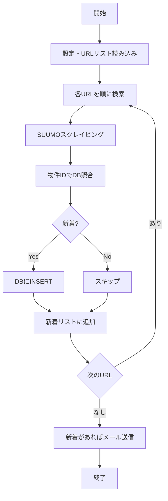

# 設計書テンプレート（AIエージェント向け）

> このテンプレートに沿って設計書を書くと、AIエージェントが実装を理解しやすくなります。
> 各セクションの目的と、記述のコツを説明しています。

---

## 1. 概要（必須）

**目的**: 何を作るのかを1〜2文で明確にする。

```
【記述例】
SUUMOの戸建検索を定期実行し、新着物件をDBに蓄積してメール通知するバッチシステムを構築する。
UIは不要。コマンドラインまたはスケジューラから実行する。
```

---

## 2. スコープ（必須）

**目的**: 含めるもの・含めないものを明確にする。

```
【記述例】
- 含める: SUUMO新築・中古戸建の検索、新着検出、DB保存、メール配信
- 含めない: 他サイト（HOME'S等）、物件詳細のスクレイピング、Web UI
```

---

## 3. 用語・前提（推奨）

**目的**: 曖昧さを減らす。エージェントが誤解しにくくなる。

```
【記述例】
- 物件ID: SUUMOのURLに含まれる nc_XXXXXXXX 形式の一意識別子
- 検索条件: URLリストCSVに記載されたSUUMO検索URL（種別・都道府県・URL）
- 新着: 前回実行時点でDBに存在しなかった物件ID
```

---

## 4. データモデル（必須）

**目的**: 何をどこに保存するかを明確にする。DBスキーマは具体的に。

```
【記述例】

### 4.1 テーブル: properties
| カラム名 | 型 | 説明 |
|---------|-----|------|
| property_id | VARCHAR(20) PK | 物件ID（nc_XXXXXXXX） |
| property_url | TEXT | 物件詳細URL |
| property_name | VARCHAR(500) | 物件名 |
| price_min | DECIMAL | 価格①（万円） |
| price_max | DECIMAL | 価格②（万円） |
| address | TEXT | 住所 |
| nearest_station | VARCHAR(100) | 最寄り駅 |
| walk_minutes | INT | 徒歩分数 |
| land_area | DECIMAL | 土地面積（m²） |
| building_area | DECIMAL | 建物面積（m²） |
| layout | VARCHAR(50) | 間取り |
| built_year | VARCHAR(50) | 築年数 |
| category | VARCHAR(50) | 種別（新築戸建/中古戸建等） |
| prefecture | VARCHAR(20) | 都道府県 |
| first_seen_at | DATETIME | 初回検出日時 |
| created_at | DATETIME | レコード作成日時 |

### 4.2 その他
- 検索条件（URLリスト）: CSVまたはDBで管理。検索ごとに種別・都道府県・URLを保持。
```

---

## 5. 処理フロー（必須）

**目的**: いつ・何が・どの順で動くかを明確にする。Mermaid図があると理解しやすい。

```
【記述例】

### 5.1 メインフロー（1回のバッチ実行）



### 5.2 処理の詳細
1. 設定ファイル（YAML/JSON/ENV）からDB接続情報・メール設定・URLリストパスを読み込む
2. URLリストの各行について、SUUMO検索を実行（全ページ取得）
3. 各物件の物件IDをDBのproperties.property_idで検索
4. 存在しなければ新着としてINSERT、新着リストに追加
5. 全URL処理後、新着リストが空でなければメール送信
6. メール本文: 新着件数、物件一覧（物件名・URL・価格・住所等）
```

---

## 6. 入出力・インターフェース（必須）

**目的**: 何を読み、何を書き、何を送るかを明確にする。

```
【記述例】

### 6.1 入力
- URLリストCSV: 種別, 都道府県, URL の3列。UTF-8またはShift_JIS。
- 設定ファイル: config.yaml または環境変数
  - db_url: SQLite/PostgreSQL接続文字列
  - smtp_host, smtp_port, smtp_user, smtp_pass
  - from_email, to_emails（配列）
  - url_list_path: URLリストCSVのパス

### 6.2 出力
- DB: properties テーブルへのINSERT
- メール: 新着物件の一覧をHTMLまたはテキストで送信
- ログ: 標準出力またはログファイル（実行日時、検索URL数、新着件数、エラー）

### 6.3 コマンドライン
python run_batch.py [--config config.yaml] [--dry-run]
--dry-run: DB書き込み・メール送信を行わず、検索と新着判定のみ実行
```

---

## 7. エラー・例外処理（推奨）

**目的**: 失敗時にどう振る舞うかを決めておく。

```
【記述例】
- 特定URLのスクレイピング失敗: ログに記録し、次のURLへ継続。全体は失敗としない。
- DB接続失敗: 即時終了。エラーメッセージを出力。
- メール送信失敗: ログに記録。DBへの保存は完了しているため、次回実行で再送はしない（要検討）。
- ネットワークタイムアウト: リトライ1回。失敗時はそのURLをスキップ。
```

---

## 8. スケジュール・実行方法（推奨）

**目的**: いつ・どうやって動かすかを明確にする。

```
【記述例】
- Windows: タスクスケジューラで毎日 6:00 に run_batch.py を実行
- Linux: cron で 0 6 * * * /path/to/run_batch.py
- 手動実行: python run_batch.py で即時実行可能
```

---

## 9. 既存コードの活用（任意）

**目的**: 流用するモジュールを明示する。

```
【記述例】
- app_realestate.py の以下を流用・リファクタしてバッチ用モジュールに分離:
  - fetch_html, build_page_url, scrape_suumo, _parse_price_man, _parse_area
  - parse_walk_and_station
- 新規: DB操作、メール送信、設定読み込み、バッチオーケストレーション
```

---

## 10. 実装フェーズ（任意）

**目的**: 段階的に作る場合の区切りを明確にする。

```
【記述例】
Phase 1: スクレイピング＋SQLite保存＋CLI実行（メールなし）
Phase 2: メール送信機能追加
Phase 3: 設定ファイル化・スケジューラ対応
Phase 4: （将来）PostgreSQL対応、ログ強化
```

---

## 記述のコツ（エージェント向け）

1. **曖昧な表現を避ける**: 「適宜」「ほど」より「3回」「60秒」のように具体的に
2. **選択肢を列挙する**: 「AまたはB」と書く。エージェントが勝手に選ばないように
3. **既存コードがあれば参照する**: ファイル名・関数名を書く
4. **Mermaid図を使う**: フローは図があると理解しやすい
5. **スキーマは表形式**: カラム名・型・説明を表で書く
6. **未定は「要検討」と明記**: エージェントが決め打ちしないように

---

## このテンプレートの使い方

1. 上記の各セクションを、あなたの要件に合わせて埋める
2. 不要なセクションは削除、必要なセクションは追加する
3. エージェントに「docs/DESIGN_xxx.md の設計書に従って実装してほしい」と依頼する
4. 設計書のパスを明示して渡すと、エージェントが参照しやすい
